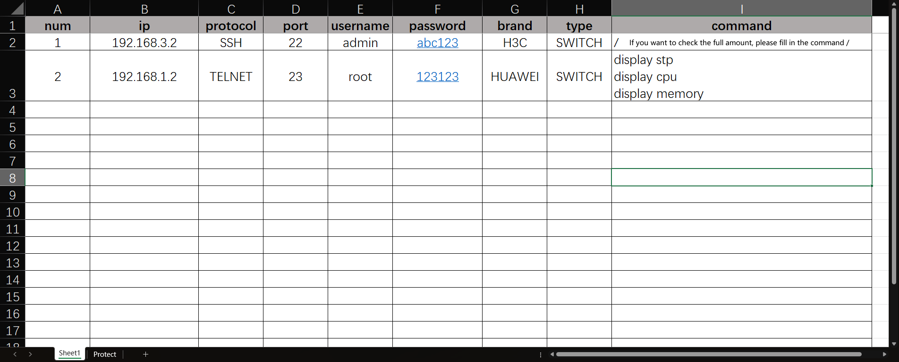
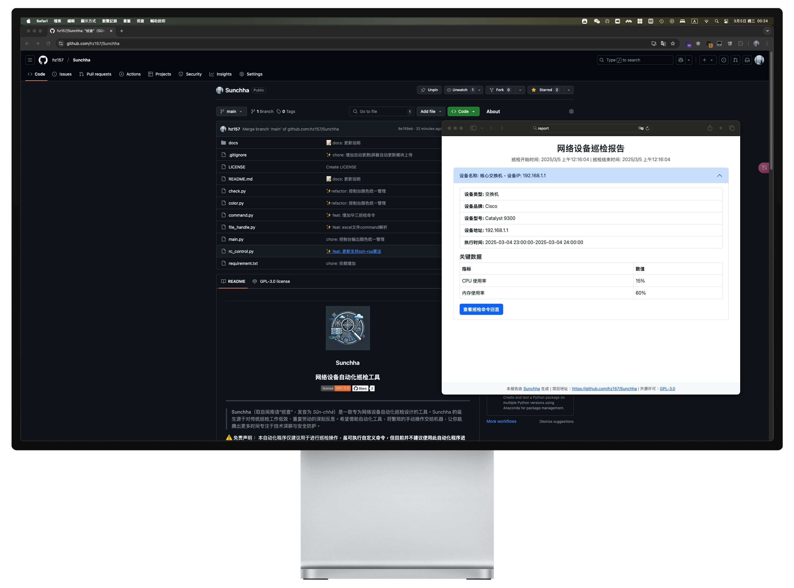

# 
<p align="center"></p>
<h3 align="center">Sunchha</h3>
<h3 align="center">网络设备自动化巡检工具</h3>
<p align="center">
  <a href="https://www.gnu.org/licenses/gpl-3.0.html#license-text"></a>
  <a href="https://github.com/hz157/Sunchha"></a>  
</p>
<hr/>

> **Sunchha**（取自闽南语“巡查”，发音为 *Sûn-chhá*）是一款专为网络设备自动化巡检设计的工具。Sunchha 的诞生源于对传统巡检工作低效、重复劳动的深刻反思。希望借助自动化工具，将繁琐的手动操作交给机器，让你能腾出更多时间专注于技术深耕与安全防护。

⚠️ 免责声明：
本自动化程序仅建议用于进行巡检操作，**虽可执行自定义命令，但目前并不建议使用此自动化程序进入使能模式执行配置命令等高危操作。**
如使用该程序执行自动化配置命令造成的网络中断后果，请自行负责！

## 目录

- [介绍](#介绍)
- [核心功能](#核心功能)
- [应用场景](#应用场景)
- [开发环境](#开发环境)
- [快速上手指南](#快速上手指南)
- [支持设备列表](#支持设备列表)
- [报告样式](#报告样式)
- [The End](#TheEnd)

## 介绍


作为一名网络工程师和安全工程师，我深知传统巡检方式既低效又繁琐——每天重复执行相似命令不仅耗时，而且容易出错。为了改变这一现状，开发了 **Sunchha**，帮助轻松管理网络设备，从而大幅提升运维效率。


## 核心功能

- **自动化巡检**  
  批量执行巡检任务，对各类网络设备进行状态检查，确保你能实时掌握设备运行情况。

- **灵活配置**  
  支持自定义命令与策略，满足各种网络环境下的多样化需求。

- **数据报告与告警**  
  自动生成详细巡检报告，并在发现异常时及时发出告警。（**功能规划中**）

- **开源安全**  
  完全开源，支持通过 `git clone` 下载代码，自行构建与部署，保障操作的透明性与安全性。


## 应用场景

- **网络运维自动化**  
  简化巡检流程，降低人工错误，让网络设备管理更加高效。

- **安全监控**  
  实时监控设备状态，迅速发现并响应潜在安全隐患，全面提升网络安全防护能力。

- **技术实践与学习**  
  为网络自动化和运维相关技术探索提供一个实战案例与学习平台。

## 开发环境
- Python 3.13.1 

## 快速上手指南
1. 克隆本仓库
```
git clone https://github.com/hz157/sunchha.git
cd sunchha
```
2. 编辑待检测的目标文档excel [target/template.xlsx](./target/template.xlsx) 编辑完毕后将excel重命名为target.xlsx，路径不变（target/target.xlsx)

3. Windows 创建并激活python虚拟环境
```
python -m venv venv
./venv/Scripts/activate
pip install -r requirement.txt
python main.py
```
3. Linux 创建并激活python虚拟环境
```
python -m venv venv
source ./venv/bin/activate
pip install -r requirement.txt
python main.py
```


## 支持设备列表

> 支持市面上大部分网络设备

详细设备支持列表请参见 [支持列表](./docs/support_brand.md)


## 报告样式
当前开发中的报告样式为HTML，可交换式报告以及PDF格式的报告。



## TheEnd
欢迎大家Star、使用并贡献代码，共同推动网络自动化运维的进步！<br>
愿 **Sunchha** 成为你在网络巡检工作中的得力助手，释放双手，拥抱无限可能！

